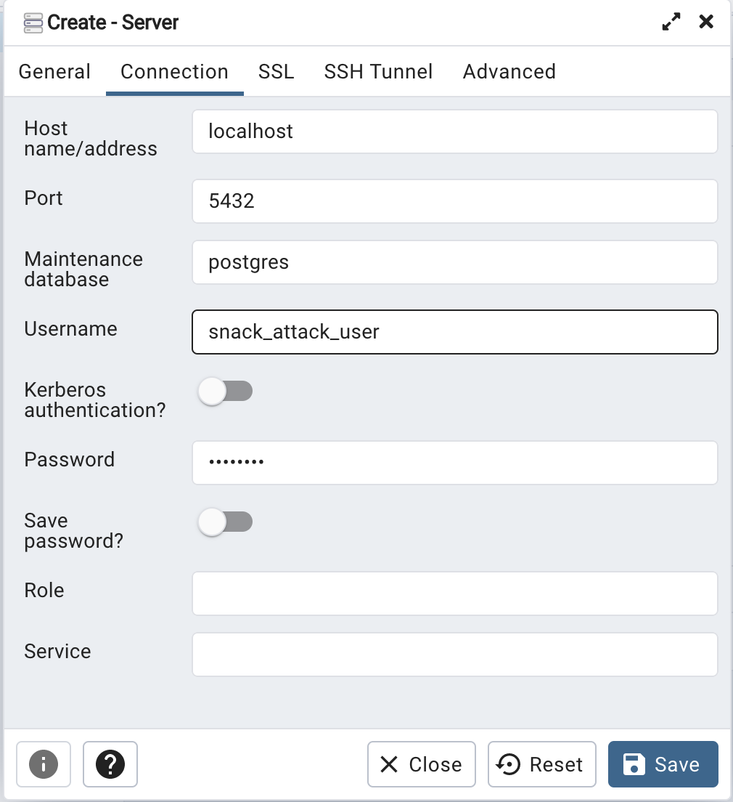

# Snack React
A snack review app with React and DotNet

## General Project Configuration

1. Install Homebrew https://brew.sh/

## Postgresql Configuration

1. Install Postgresql12 (`brew install postgresql@12`)
   1. Developers Note: Must install postgresql@12 over the default postgresql from Homebrew. Will look to migrate to a newer version at a later time.
   2. Link postgresql12: `brew link postgresql@12`
   3. Verify postgresql is available on the terminal/command-line: `psql --version`
2. Create the default `postgres` user. `$ createuser postgres`
3. Create the SnackAttack user. `$ createuser -P --interactive snack_attack_user`
   1. Set password to `password`
   2. Following the interactive guide, answer the following:
      1. `Shall the new role be a superuser? (y/n) n`
      2. `Shall the new role be allowed to create databases? (y/n) y`
      3. `Shall the new role be allowed to create more new roles? (y/n) n`


### PgAdmin Configuration
1. Install PgAdmin (`brew install pgadmin4`)
2. Create a new server localhost server using the `snack_attack_user` credentials 
   
    

    **Figure 1** PgAdmin Configuration


## Migrations
To run migrations ensure that `$PROJECT_ROOT/src/Web/appsettings.json` has `"UseInMemoryDatabase": false`. Then run the following:

```
cd $PROJECT_HOME
dotnet ef migrations add "{NAME}" --project src/Infrastructure --startup-project src/Web --output-dir Persistence/Migrations
```
